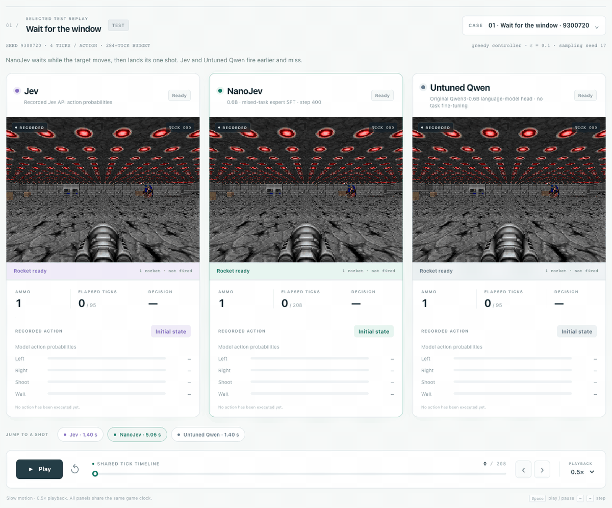

# NanoJev — A nano replica of [Jev](https://typesafe.ai/blog/introducing-system-one-models-and-jev)

**English** | [简体中文](README.zh-CN.md)

**A 0.6B parallel decision model: states and questions in, complete probability distributions out. Zero output-token decoding.**

[Live demos](https://nanojev-dev.tianyuchen99.chatgpt.site/side-by-side?autoplay=1#maze) · [Model](https://huggingface.co/C-Tianyu/NanoJev-dev) · [Dataset](https://huggingface.co/datasets/C-Tianyu/NanoJev-Data-dev)

## What's new

**September 20, 2026 — One model, four games.**

- **One unified checkpoint** now powers Maze, Snake, ViZDoom Basic and Predict Position.
- **Bigger game replays:** a 50×50 maze completed in 225 attempts, and a full 256-step Snake run collecting 30 food items.
- **Moving-target shooting:** Predict Position test successes improve from 11/128 to **27/128**, while Basic retains **128/128**.
- **Updated model and data:** the selected step-400 checkpoint, 18,760 mixed-task data rows across five splits, and reproducible evaluation records.

## Three models, side by side

Real browser replays of **[Jev](https://typesafe.ai/blog/introducing-system-one-models-and-jev), NanoJev and Untuned Qwen**. These animations loop automatically; click either one to open its interactive player. All four demos use the same current NanoJev checkpoint.

### Find the exit · 50×50 Maze

[](https://nanojev-dev.tianyuchen99.chatgpt.site/side-by-side?autoplay=1#maze)

NanoJev reaches the exit in **225 attempts**, versus **2,738** for [Jev](https://typesafe.ai/blog/introducing-system-one-models-and-jev) and **4,726** for Untuned Qwen. Each system combines local safety probabilities with the same exploration code and remembered open paths.

### Choose the moment · Predict Position

[](https://nanojev-dev.tianyuchen99.chatgpt.site/predict-position?autoplay=1)

One moving target, one rocket. NanoJev fires at **5.06 s** and hits at **5.94 s**; [Jev](https://typesafe.ai/blog/introducing-system-one-models-and-jev) and Untuned Qwen fire at **1.40 s** and miss. The player includes two selected NanoJev wins, with original frames, action probabilities and actual shot times.

[Play Snake](https://nanojev-dev.tianyuchen99.chatgpt.site/side-by-side?autoplay=1#snake) · [Play Basic](https://nanojev-dev.tianyuchen99.chatgpt.site/?autoplay=1)

## What NanoJev does

- **Parallel decisions:** batch independent states, questions and candidate paths in one backbone forward.
- **Dynamic candidates:** Choice returns a distribution over 2–255 supplied candidates using a shared scoring head.
- **Boolean and ordered scores:** predict a proposition's probability, or a distribution and expectation over 2–10 ordered levels.
- **Direct probabilities:** rank, select or sample actions without generating answer tokens.
- **One small backbone:** Qwen3-0.6B with decision heads, reused across all four game tasks and a persistent inference service.

Each request supplies a **state**, a **question** and its **candidates**. The backbone encodes candidate paths; shared heads produce the requested probabilities. Choice uses set attention and a softmax, Boolean uses a sigmoid, and Score returns a probability-weighted level.

## Held-out gameplay

Successful episodes on the complete **274-case test set**, using the same observation interface, candidate actions and seeded epsilon-greedy controller across systems:

| Model | Maze | Snake | Basic | Predict Position |
|---|---:|---:|---:|---:|
| **NanoJev** | **4/10** | **8/8** | **128/128** | **27/128** |
| [Jev](https://typesafe.ai/blog/introducing-system-one-models-and-jev) | 7/10 | 8/8 | 56/128 | 11/128 |
| Untuned Qwen3-0.6B | 2/10 | 0/8 | 56/128 | 11/128 |

Test and OOD together contain **548 cases per model**. Every evaluated trajectory passes independent simulator replay. The large navigation showcases above use their displayed local-question and code-planning settings.

[Complete test and OOD results](docs/SONIC_PREDICT_POSITION_RESULTS.md) · [Training pipeline](docs/SONIC_PREDICT_POSITION.md)

## Model and data

The current release is **`hard_lr1e5`, step 400**: one shared model trained with complete-question cross entropy. Updates mix Maze, Snake, Basic and Predict Position with weights **1/3, 1/3, 1/6, 1/6**.

The hard-target and soft-target variants each contain **18,760 rows across train, dev, calibration, test and OOD**. The selected hard-target training split has **10,898 rows**, including **6,788 Predict Position questions**; **10,893** training questions pass the target-validity filter. Existing Maze, Snake and Basic splits are preserved. The package also includes the matched soft-target variant, expert trajectories and evaluation records.

The development model and data are on Hugging Face in the repositories linked above. Sign in with the authorized account to download them.

## Quick start

```bash
git clone --branch feature/unified-game-policy-iteration https://github.com/TianyuCodings/NanoJev-dev.git
cd NanoJev-dev
python -m pip install -r requirements-toy.txt huggingface_hub
hf auth login
```

Download the current checkpoint and data:

```python
from huggingface_hub import snapshot_download

snapshot_download(
    repo_id="C-Tianyu/NanoJev-dev",
    local_dir="checkpoints/NanoJev-unified",
    allow_patterns=["best.safetensors", "config.json", "tokenizer/*", "backbone_config/*"],
)
snapshot_download(
    repo_id="C-Tianyu/NanoJev-Data-dev",
    repo_type="dataset",
    local_dir="data/NanoJev-unified",
)
```

Start inference in a CUDA environment:

```bash
python scripts/serve_decisions.py \
  --checkpoint-dir checkpoints/NanoJev-unified \
  --web-root web --port 8765 --disable-native-triton
```

The service loads the model once. Send state/question batches to **`POST http://127.0.0.1:8765/api/evaluate`**.

To explore the recorded games locally:

```bash
python3 -m http.server 8080 --bind 127.0.0.1 --directory web
```

Open **http://127.0.0.1:8080/dev/side-by-side.html?autoplay=1#maze** or **http://127.0.0.1:8080/dev/predict-position.html?autoplay=1**.

## Development notes

[Input contract](docs/TYPESAFE_CONTRACT.md) · [Unified environments](docs/UNIFIED_GAMES.md) · [Atomic planning](docs/ATOMIC_PLANNING.md) · [Predict Position replay](docs/PREDICT_POSITION_DEMO.md) · [Shooting replay](docs/SHOOTING_DEMO.md)

## Roadmap

- [x] One unified checkpoint for Maze, Snake and both shooting tasks.
- [x] 50×50 Maze, long Snake games and synchronized three-model browser replays.
- [x] Mixed-task SFT, reproducible data splits and independently replayed evaluation.
- [ ] RLCD post-training for broader long-horizon tasks.
- [ ] Shared-prefix inference and larger candidate batches.
- [ ] Broader shooting scenarios and structured input support.
