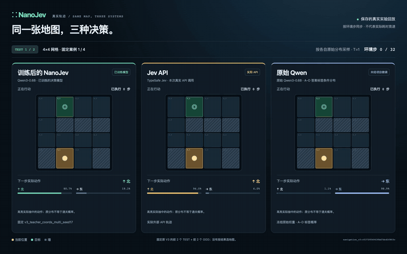
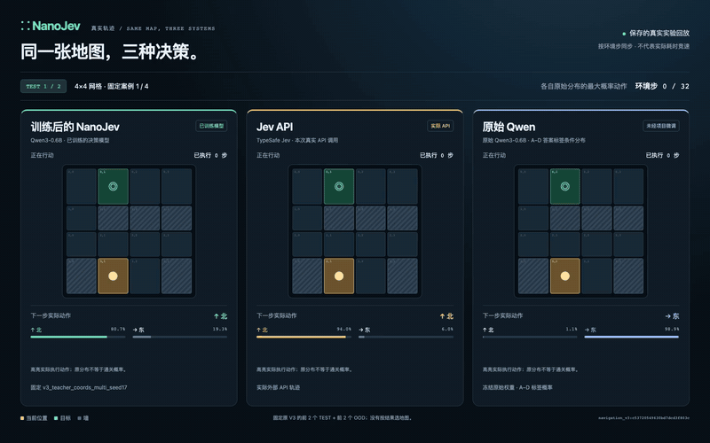

# NanoJev — A nano replica of [Jev](https://typesafe.ai/blog/introducing-system-one-models-and-jev)

**简体中文** | [English](README.md)

> 当前为 NanoJev 私有开发仓库。新增大迷宫、贪吃蛇与校准奖励实验，详见[英文开发说明](README.md)、[游戏流程](docs/SCALED_GAMES.md)和 [RLCD 实验](docs/RLCD_EXPERIMENT.md)。下方保留已发布基线的演示与结果。

当前主线：[原子判断与代码规划](docs/ATOMIC_PLANNING.md)。局部模型在测试集和 50×50 保留集的准确率分别为 77.84% 和 76.56%；完整英文报告包含实际探索轨迹与 RLCD 对照。
**[Jev](https://typesafe.ai/blog/introducing-system-one-models-and-jev) 的迷你复现：一个以 Qwen3-0.6B 为基础的并行决策模型。** 输入状态、问题和候选集合，直接得到全部决策的概率分布。

NanoJev 将多个状态、多个问题和所有候选放进一次模型前向，无需逐 token 生成答案。项目提供数据生成、模型训练、评测、推理服务和可视化的完整流程。

[Hugging Face 模型](https://huggingface.co/C-Tianyu/NanoJev) · [Hugging Face 数据集](https://huggingface.co/datasets/C-Tianyu/NanoJev-Data)

## 看 NanoJev 完成任务

**精选真实通关案例：NanoJev 和 [Jev](https://typesafe.ai/blog/introducing-system-one-models-and-jev) 都到达目标，原始 Qwen 在步数上限内未到达。** 两段视频展示相同的 4 张地图，覆盖 4×4 和 6×6；三列按环境步数同步，实时显示所选动作和候选概率。

### 按概率选择动作

[](assets/comparison_sample.mp4)

[观看完整视频](assets/comparison_sample.mp4) · [高清预览](assets/comparison_sample.png)

### 每步选择最高概率动作

[](assets/comparison_greedy.mp4)

[观看完整视频](assets/comparison_greedy.mp4) · [高清预览](assets/comparison_greedy.png)

GIF 展示首个案例，完整视频展示全部 4 例。交互页面支持切换地图、暂停和逐步查看动作。

## 核心能力

| 能力 | 已实现 |
|---|---|
| 多状态并行 | 同一批处理多个独立环境状态 |
| 多问题并行 | 每个状态同时回答多个问题 |
| 动态候选 | Choice 每题支持 2–255 个候选，共享同一个决策头 |
| 多种决策类型 | Choice 候选分布、Boolean 概率、Score 的 2–10 级分布及期望 |
| 直接输出概率 | 一次前向得到完整候选分布，无输出 token 解码 |
| 轻量底座 | 使用 Qwen3-0.6B，支持单卡训练与部署 |
| 持久推理服务 | 模型加载一次，复用权重处理后续请求 |

实际运行已验证：**6 个状态 · 18 个问题 · 44 条候选路径 · 1 次 backbone 前向**。[并行调用记录](research/parallel_example_v3.json)

## 40 张地图的评测结果

使用 T=1 概率采样，分别评测 20 张 4×4 测试地图和 20 张 6×6 OOD 地图。下面是完整 40 图的完成率：

| 模型 | 4×4 测试地图 | 6×6 OOD 地图 |
|---|---:|---:|
| **NanoJev** | **19/20 · 95%** | **18/20 · 90%** |
| [Jev](https://typesafe.ai/blog/introducing-system-one-models-and-jev) | 20/20 · 100% | 19/20 · 95% |
| 原始 Qwen3-0.6B | 7/20 · 35% | 3/20 · 15% |

**NanoJev 在更大的 6×6 地图上达到 90% 完成率，原始 Qwen 为 15%。** 原始 Qwen 使用预训练权重，未做本任务微调。

[完整评测结果](research/nanojev_comparison_public.json) · [逐局核验](research/nanojev_comparison_verification.json)

## 快速体验

交互回放只需 Python：

```bash
git clone https://github.com/TianyuCodings/NanoJev.git
cd NanoJev
python3 -m http.server 8080 --bind 127.0.0.1 --directory web
```

打开 **http://127.0.0.1:8080/comparison.html**，即可并排查看三种模型的真实对局。

在兼容 CUDA 的环境中安装运行依赖，并登录有权访问当前私有模型与数据集的 Hugging Face 账号：

```bash
python -m pip install -r requirements-toy.txt
hf auth login
```

下载最终模型与数据。模型文件筛选仅获取根目录的最终 checkpoint：

```python
from huggingface_hub import snapshot_download

snapshot_download(
    repo_id="C-Tianyu/NanoJev", local_dir="checkpoints/NanoJev",
    allow_patterns=["best.safetensors", "config.json", "tokenizer/*", "backbone_config/*"],
)
snapshot_download(
    repo_id="C-Tianyu/NanoJev-Data", repo_type="dataset", local_dir="data/NanoJev",
)
```

使用下载的模型启动持久服务：

```bash
python scripts/serve_decisions.py \
  --checkpoint-dir checkpoints/NanoJev \
  --web-root web --port 8765
```

打开 **http://127.0.0.1:8765**，或向 **`POST /api/evaluate`** 发送批量请求。

## 实现流程

```text
生成状态、问题与候选
        ↓
构建完整目标分布，按源场景划分数据集
        ↓
Qwen3-0.6B 编码 + 动态候选决策头
        ↓
按完整问题计算分布损失并训练
        ↓
留出集概率评测 + 游戏闭环评测
        ↓
批量推理服务 + 交互回放
```

Choice 将候选路径编码为共享分数，通过集合注意力与 softmax 输出每题的 K 维分布；Boolean 使用 sigmoid，Score 输出完整等级分布与期望。训练使用完整问题的目标分布计算 `L = -Σ qᵢ log pᵢ`，microbatch 与梯度累积均保留问题内的候选集合。

导航训练阶段构建了 **500 张地图、3,000 个状态、9,000 个问题**。实际运行中，每组导航训练在单张 A100 80GB 上完成 1,200 步，耗时约 8.3–10 分钟。

[完整训练与运行手册（English）](research/pipeline_runbook.md) · [Python 依赖](requirements-toy.txt)

## 待办

- [ ] **RLCD**：加入面向校准决策的强化学习训练流程（Reinforcement Learning for Calibrated Decisions）。
