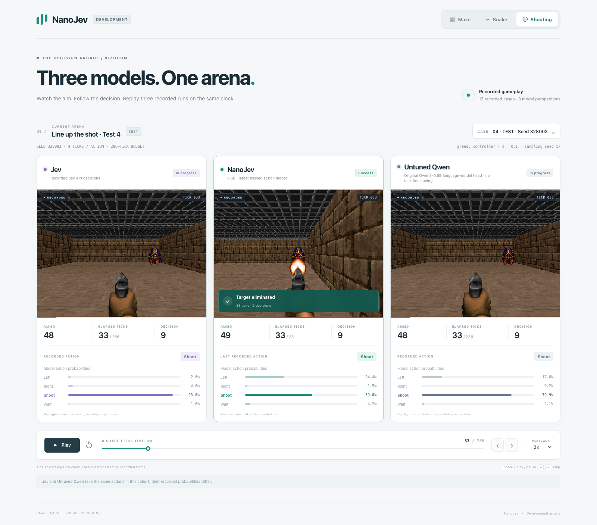

# Development shooting replay

[Open the independent development arcade](https://nanojev-dev.tianyuchen99.chatgpt.site/).

**Moving targets:** the new [Predict Position replay](PREDICT_POSITION_DEMO.md)
adds a single-rocket scenario, actual shot-time markers and the selected mixed
SFT model alongside Jev and Untuned Qwen.

The light viewer places **Jev, NanoJev, and Untuned Qwen** beside each other using real ViZDoom Basic frames. Play, pause, seek, change speed, step one tick, or select any of the twelve recorded cases. Each model stops at its actual terminal tick while the other recordings continue. Maze and Snake are available in the same independent hosting project.



## Recordings

| Policy | Test | Eight-tick OOD |
| --- | ---: | ---: |
| NanoJev | 6/6 | 6/6 |
| Jev | 3/6 | 3/6 |
| Untuned Qwen | 3/6 | 3/6 |

All systems use the same case definitions, visible-state text, available actions, greedy controller with epsilon `0.1`, and sampling seed `17`. The twelve cases come from the existing recorded Jev test/OOD cohort. They are separate from the larger [APPO supervision benchmark](APPO_SUPERVISION.md).

NanoJev uses the selected hard-target seed-17 checkpoint, SHA256 `38116340795de1c82369b7fe15819d92d79600a7b4dc7a3cd0d4390cb6782639`. Untuned Qwen uses the original `Qwen/Qwen3-0.6B` checkpoint at revision `c1899de289a04d12100db370d81485cdf75e47ca`, with its original language-model head. Its full action question maps the four candidate IDs to A–D; the displayed distribution is conditional on those offered next-token choices. The baseline has no project training or newly initialized decision head.

In this cohort, Jev and Untuned Qwen have the same dominant action at every visited state and execute identical action sequences under the common controller. Their probabilities differ, and the viewer preserves both recordings. NanoJev also chooses movement actions to align its shots.

The default case is `test-doom_basic-328003`: NanoJev eliminates the target in **33 ticks with one round**, while both other policies reach the **286-tick deadline**. This is an outcome-selected illustration, chosen for the initial target's horizontal offset. All twelve cases, including six where every system succeeds, remain selectable.

## Real frames and verification

The exporter resets the original environment with each recorded seed and replays every executed action. It checks all observations, rewards, termination flags, counters, and final results against the source. A wrapper captures RGB after each existing one-tick simulator call without advancing extra time. Each exported image is placed in a lossless WebP atlas and decoded back to verify exact pixels.

The reader contains **5,219 frames across 36 complete runs**. If ViZDoom has no terminal image, `image_tick` identifies the last available real frame. The terminal status and outcome still come from the actual final transition. The timeline measures game ticks; the bars preserve model probabilities before exploration, and the highlighted action is the one actually executed.

The desktop/mobile browser check verifies all twelve cases, including 279 canvas comparisons against the decoded source image crops, action bars, playback controls, case selection, and terminal holds. Source and asset hashes are recorded in the [media receipt](../results/shooting_demo_v1/build_manifest.json).

## Reproduce

Use the recorded case registry and the standard inference dependencies. The two model runs require the corresponding locally available weights. Frame export needs only the CPU dependencies in `requirements-shooting-demo.txt`.

```bash
python scripts/unified_game_pipeline.py rollout \
  --cases configs/shooting_demo_v1_cases.jsonl \
  --output runs/shooting_demo_v1/nanojev.jsonl \
  --engine checkpoint --checkpoint /path/to/hard_s17 \
  --controller greedy --epsilon 0.1 --seed 17 --splits test,ood \
  --env-batch 12 --batch-questions 12 --max-length 8192

python scripts/evaluate_native_qwen_shooting.py \
  --cases configs/shooting_demo_v1_cases.jsonl \
  --output runs/shooting_demo_v1/base.jsonl \
  --controller greedy --epsilon 0.1 --seed 17 --splits test,ood \
  --batch-states 4 --max-length 8192 --precision bf16

python scripts/build_shooting_demo.py \
  --jev data/unified_v2/jev_complete.jsonl \
  --nanojev runs/shooting_demo_v1/nanojev.jsonl \
  --base runs/shooting_demo_v1/base.jsonl \
  --cases configs/shooting_demo_v1_cases.jsonl \
  --output web/dev

python3 -m http.server 8081 --bind 127.0.0.1 --directory web
```

Open `http://127.0.0.1:8081/dev/`. Run `scripts/check_shooting_demo.mjs` with `--url` and a fresh `--output` directory; provide the local `PLAYWRIGHT_MODULE` and `CHROME_EXECUTABLE` paths through the environment.

`scripts/stage_development_site.py` copies an explicit static asset list into a separate hosting checkout. It creates independent navigation and canonical metadata for the copied Maze/Snake page. The existing public site's checkout and deployment remain unchanged. The standalone site contains recorded media and viewer code; model weights and credentials remain outside the hosting bundle.
